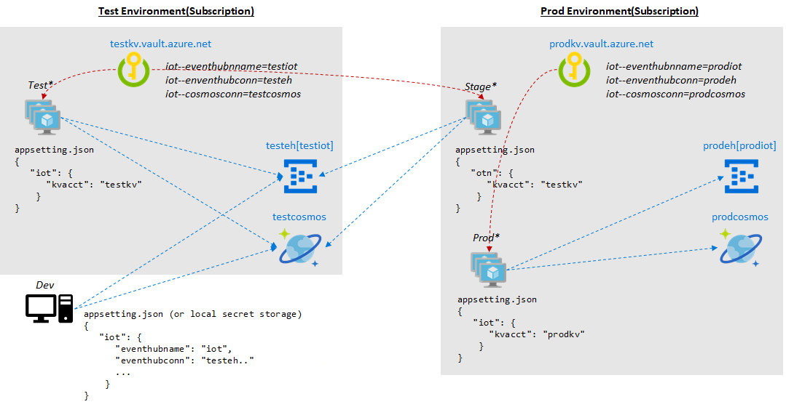

# .NET Core Config(Secret) Management

## Setting Local Config

Add/update json format config in `appsettings.json` for Production environment. For Development environment, set `appsettings.Development.json`.

Default environment is `Development` and you can update default environment setting in `Properties\launchSettings.json`. You can also change `applicationUrl` from `http://localhost:5000` to `http://*:5000` in this file.

> For more information: https://docs.microsoft.com/en-us/aspnet/core/fundamentals/environments?view=aspnetcore-2.2

## Using Secrets storage for local setting

You can store config settings in local secret storage. It is secure for development because you're not adding config in `appsettings.json` file.

>  For more information: https://docs.microsoft.com/en-us/aspnet/core/security/app-secrets?view=aspnetcore-2.2&tabs=windows

To enable secret storage (local pc) by update `*.csproj`. Note that, use VS 2017 `guidgen` or similar tool to create new GUID.

```
  <PropertyGroup>
    <TargetFramework>netcoreapp2.2</TargetFramework>
    <AspNetCoreHostingModel>InProcess</AspNetCoreHostingModel>
    <UserSecretsId>B8FC491A-CC7F-4C3A-A4FB-CF5F84BAEB79</UserSecretsId>
  </PropertyGroup>
```

To add/remove/list secrets on storage using `dotnet` cli.

```
dotnet user-secrets set iot:eventhubname test
```

### Using KV(Key Vault) and MSI(Managed Service Identity) to set configuration

[Provision KV](https://docs.microsoft.com/en-us/azure/key-vault/quick-create-portal) and [enable MSI](https://docs.microsoft.com/en-us/azure/active-directory/managed-identities-azure-resources/tutorial-windows-vm-access-nonaad) on VM/VMSS first.

When adding secret to KV, use `--` instead of `:` for section delimiter for KV secret name. For example, use `iot--eventhubname` key name in KV's secret instead of `iot:eventhubname`.

Add and implement `ConfigureAppConfiguration` as below. Note that this will read all secrets from KV.

```
        public static IWebHostBuilder CreateWebHostBuilder(string[] args) =>
            WebHost.CreateDefaultBuilder(args)
                .ConfigureAppConfiguration((context, config) =>
                {
                    if (context.HostingEnvironment.IsProduction())
                    {
                        var builtConfig = config.Build();
                        var kvacct = builtConfig["iot:kvacct"];

                        Trace.WriteLine($"TRACE:kevault url= https://{kvacct}.vault.azure.net/");

                        var azureServiceTokenProvider = new AzureServiceTokenProvider();
                        var keyVaultClient = new KeyVaultClient(
                            new KeyVaultClient.AuthenticationCallback(
                                azureServiceTokenProvider.KeyVaultTokenCallback));

                        config.AddAzureKeyVault(
                            $"https://{kvacct}.vault.azure.net/",
                            keyVaultClient,
                            new DefaultKeyVaultSecretManager());
                    }
                })
                .UseStartup<Startup>();
```

This will set all secrets into config and you can access these just like normal config (IConfiguration).

```
        public IotController(IConfiguration _config)
        {

            EventHubConnectionString = _config["iot:eventhubconn"];
            EventHubName = _config["iot:eventhubname"];
            ...

        }
```

> For more information: https://docs.microsoft.com/en-us/aspnet/core/security/key-vault-configuration?view=aspnetcore-2.2

> Sample app: https://github.com/aspnet/Docs/tree/master/aspnetcore/security/key-vault-configuration/sample

### Configuration order

There are many places to add the same configuration. Configuration order is 
`appsettings.json` -> `local secret storage` -> `Azure Key Vault`. That is, if there are the same config in `appsettings.json` and `Key Vault`, values in the `Key Vault` is used.

## Setup KV for Test and Prod environment

You can setup KV for test and prod environment and use right configuration for each environment as below.



## Run Sample app

Once you build a app, test whether it is correctly configured. If you deployed on Azure then use right url for test.

```
Invoke-WebRequest -Uri http://localhost:5000/config/eventhub | Write-Host
```

Then, send a sample message to the app.

```
$body = @{Model = "model-t"; Ver=1.1; Payload="none" } | ConvertTo-Json

Invoke-WebRequest -Method POST -Headers @{"Content-Type"="application/json"} -Body $body -Uri http://localhost:5000/api/iot
```